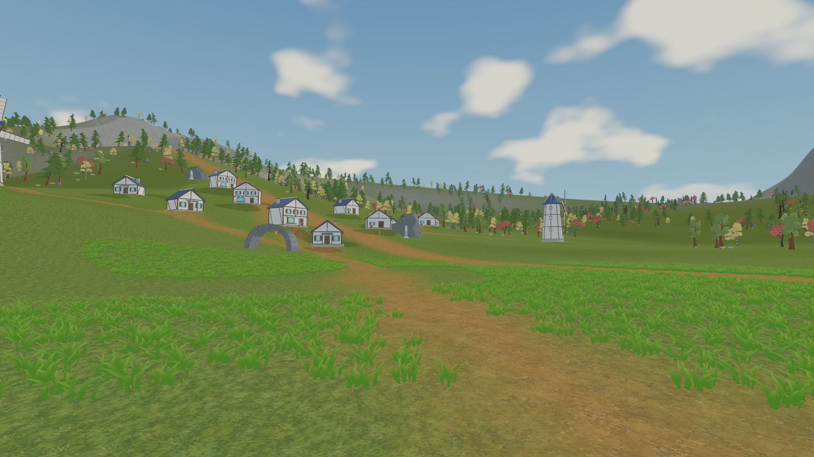

# 오르비스 — 캐릭터·보스 로컬 통합 보고

2026-09-15. 검증 대상 프로젝트는 `D:/Project/ORBIS`다. 이 보고서의 전달 및 타깃 Unity 검사 수치는 함께 제공한 `Verification.json`의 실제 결과를 따른다. 이전 문서의 ‘staging 검증/전달 대기’는 당시 상태이며, 최종 전달 여부는 이 보고서와 검증 JSON이 기준이다.

**로컬 반영 완료:** 파일 754개와 Credits를 반영하고 Unity 6 타깃 프로젝트에서 편집 모드 검사를 통과했다. 의존 파일 1,790개의 임포트 후 해시가 모두 일치하며, 원본 7종과 보류 중인 조력자 파일도 전달 전 해시를 유지한다. Play 없이 저장된 오브젝트 33,656개·지형 4타일이 보이고 누락된 스크립트/참조/메시/머티리얼은 모두 0개다.

## 적용 대상

| 대상 | 최종 연결 | 유지한 구조 |
|---|---|---|
| 스텔라 | StellaIntegrated12 모델 → Stella12GripRuntime01 프리팹·26모션 | 66본 Humanoid, 기존 FSM/저장 정체성, 원본 얼굴·헤어 atlas |
| 폴라리스 | OriginTrial01 모델 → Motion06GripRuntime01 프리팹·26모션 | 64본 Humanoid, 기존 FSM/저장 정체성 |
| 불 보스 | FireBoss / Original01 | 승인한 여섯 다리·말린 꼬리 Generic 리그 |
| 물 보스 | WaterBoss / Original01 | 척추·긴 꼬리·지느러미·목·턱 유영형 리그 |
| 바람·번개 보스 | WindBoss / LightningBoss / Original01 | 각 네 다리와 두 날개 |
| 바위 보스 | RockBoss / Original01 | 원본 실루엣과 보정한 어깨 가중치 |

두 주인공은 카탈로그에 연결해 일반 게임 시작에서도 사용한다. 26모션은 직접 제작 이동/전환 19개와 확인된 CC0 KayKit 전투 7개다. 공용 여정의 검을 실제 손 소켓과 손가락 포즈에 맞췄다. Mixamo 파일은 제공되지 않아 Mixamo 자체의 결과를 검증했다고 표기하지 않는다.

보스마다 Idle/Move/Attack/Hurt/Exposed/Dead 6클립을 연결했다. M4의 기존 피해 시계·약점·사망/세이브 로직을 유지하며, Move는 라이브러리 클립이고 새 추적 AI는 아니다. 각 Guardian에 저장한 모델·아웃라인 자식은 Play 전에도 확인할 수 있다.

전체 경로·해시는 [애셋 매핑](Final_Asset_Mapping_Draft.md), 파일별 변경/생성 구분은 [반영 파일 목록](ChangedFiles.md)에 있다. 원본 `.blend`는 변경하지 않았다. 기존 파일 14개와 Credits의 변경 전 내용은 staging 전달 기록 폴더에 백업했다.

## 씬과 조작

1. Unity 6에서 `Assets/Scenes/Field.unity`를 열거나 **Orbis > Field > Open Field**를 선택한다. 편집할 필드는 하나다. M0/M1 등의 폴더는 기존 시스템 코드이며, 실행용 지역 씬은 Addressables 스트리밍 출력으로 유지한다.
2. Play 전 Hierarchy에서 `Agnia / Teluna / Zephyr / Granite / Voltheim Field Guardian`을 검색하고 선택 후 **F**로 모델을 확인한다. 저장된 지형·식생·건물도 편집 상태에서 보인다. 주인공은 기존 선택/세이브에 따라 Play 시 스폰한다.
3. Play 후 새 테스트 프로필은 주인공 선택 화면, 기존 프로필은 저장한 주인공으로 진입한다. 다른 성별을 확인하려고 실제 세이브를 삭제하지 않는다.
4. **WASD 이동, Shift 달리기, Space 점프, 마우스 카메라, 왼쪽 클릭 3단 공격, Tab 원소 전환, G 원소 스킬, Q 궁극기 연출 시험, 1–4 파티 전환**을 확인한다.
5. 보스 위치와 약점은 매핑 표를 따른다. 약점은 화→수, 수→뢰, 풍→암, 암→화, 뢰→수다. 모델의 예고·공격·피격·약점 노출·사망 표현을 확인한다.

## 검증과 한계

저장 Field 검사, 두 주인공의 평지/12·24도 경사/연속 내리막/상태 초기화 검사, 보스 5종의 실제 전투 표현 검사를 통과했다. 관련 회귀 검사는 36개 통과했다. 런타임 씬 export·6씬 오클루전 베이크·Windows Release 빌드가 성공했고, Packed Player의 5지점 렌더와 지역 로드→해제→재로드 `[5,0,5]`를 확인했다.

Packed Player 성능 검사는 오프스크린 렌더이므로 실제 화면에 표시되는 게임 FPS, 이동 IK 최악 비용이나 모든 보스 전투 비용의 보증은 아니다. 기존 빌드 경고 2개와 Editor 종료 시 경고는 보고서에 남겼다. 상세 결과는 [Field 검증](Field_Animation_Final.md), [이동 검증](Locomotion_Final.md), [검 파지](Weapon_Grip_Final.md)를 참고한다.

약접지 구간의 작은 발 침투, 스텔라 부츠의 띠·각진 장갑·얼굴 명암 경계는 남는다. 경사 정량 프레임157과 이미지가 같은 시점을 보장하지 않아 수치와 독립적인 이미지158 전후를 구분해 기록했다. 현재 환경/캐릭터를 콘셉트아트나 몬드성 수준의 최종 아트로 완료 처리하지 않는다.

보스의 동일 앵글 전후 사진·실제 재생 영상, 두 주인공의 이동/내리막 영상, 선택한 손·발 클로즈업은 `TestResults/CharacterPipeline/`에 전달했다. 중간 Blender 후보와 모든 녹화 원본 프레임·대용량 진단 JSON은 staging에 보관하며 이전 검수 문서의 전체 폴더 링크까지 배포한 것은 아니다.

## 남은 결정

- 기존 약점 수정 표지가 큰 모델 몸통에 가려지는 문제는 **머리 위 표시 / 몸 앞 표시** 선택 대기다. 위치를 임의 변경하지 않았고 피해 판정은 기존 보스 몸체 전체에 유지했다.
- 조력자와 일반 몬스터는 사용자 원본 준비 대기이며 이번 교체에서 제외했다.
- 사용자 제공 모델·텍스처의 출처와 공개 배포 권리는 확인 대기다. `Credits.md`에서 CC0 외부 팩과 사용자 제공 자료를 분리했다. **GitHub 업로드와 PC 종료는 실행하지 않았다.**

## 실제 프로젝트에서 얻은 편집 모드 증거

[Hierarchy 구조 JSON](../../TestResults/WorldDev/Character_Field_Final_Hierarchy.json) · [마을 화면](../../TestResults/WorldDev/Character_Field_Final_Village.png) · [전체 지도](../../TestResults/WorldDev/Character_Field_Final_Overview.png) · [흑백 지형](../../TestResults/WorldDev/Character_Field_Final_Silhouette.png)

불 보스: [교체 전](../../TestResults/CharacterPipeline/FieldIntegration/BossVisual05/FireBoss_Full_Before.png) / [교체 후](../../TestResults/CharacterPipeline/FieldIntegration/BossVisual05/FireBoss_Full_After.png) / [실제 전투 재생 영상](../../TestResults/CharacterPipeline/BossRuntimePlayback/Runtime01/FireBoss/runtime.mp4). 다른 네 보스도 같은 폴더에 같은 형식으로 제공한다.
